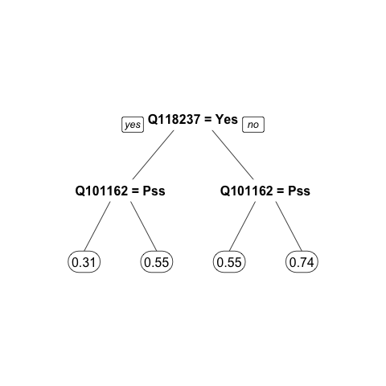
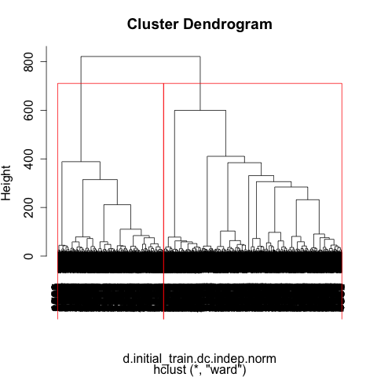
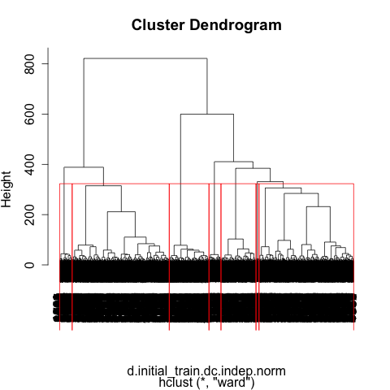

<h1>Kaggle: Show of Hands -- Predicting Happiness</h1>

<h2>Introduction</h2>
Recently, I got to compete in my first <a href='www.kaggle.com' target='_blank'>Kaggle</a> competition. It was a private competition for students taking the Analytics Edge course on <a href='www.edx.org' target='_blank'>EdX</a>.

It was an exhilarating learning experience. The goal of the competition was to predict whether poll respondents were happy or unhappy. The data was collected and distributed for the competition by a polling app called <a href='http://www.showofhands.mobi/' target='_blank'>Show of Hands</a>.

The data comprised of the following demographic information:
year of birth 
gender 
income 
household status 
education level 
party preference 

In addition, the data contained poll respondents' answers to 101 questions with binary answers. For example: 
Are you good at math? 
Have you cried in the past 60 days? 
Do you brush your teeth two or more times every day? 
Mac or PC? 
Do you drink the unfiltered tap water in your home? 
Were you an obedient child? 
Do you personally own a gun? 

The first few rows and columns of the sample data are shown below.
    > head(initial_train_test)
      UserID  YOB Gender             Income  HouseholdStatus        EducationLevel       Party Happy Q124742 Q124122 Q123464 Q123621 Q122769 Q122770 Q122771
    1      1 1938   Male               <NA> Married (w/kids)                  <NA> Independent     1      No    <NA>      No      No      No     Yes  Public
    2      2 1985 Female  $25,001 - $50,000 Single (no kids)       Master's Degree    Democrat     1    <NA>     Yes      No     Yes      No      No  Public
    3      5 1963   Male      over $150,000 Married (w/kids)                  <NA>        <NA>     0      No     Yes      No     Yes      No      No Private
    4      6 1997   Male $75,000 - $100,000 Single (no kids)   High School Diploma  Republican     1    <NA>     Yes     Yes      No    <NA>     Yes Private
    5      7 1996   Male  $50,000 - $74,999 Single (no kids)          Current K-12        <NA>     1      No      No      No      No     Yes     Yes  Public
    6      8 1991 Female      under $25,000 Single (no kids) Current Undergraduate        <NA>     1     Yes     Yes      No    <NA>    <NA>    <NA>  Public

A significant portion (about a quarter) of the data was missing (marked yellow).
!Alt_text(./figures/missingDataMap.png)

<h2>First Approach</h2>

<h3>1. Data Pre-processing</h3>
First, I created a new column Age, using the YOB (year of birth) column. I then removed the UserID column in the initial

I could easily spot that there were obvious invalid data entries. People with "negative" numbers for their ages, people over 100, etc. I decided to just remove them commpletely.

    > initial_train_test <- subset(initial_train_test, Age > 13 & Age < 100)
    > final_test <- subset(final_test, Age > 13 & Age < 100)

As for those missing values, my first reaction was imputation. I utilized complete() and mice() functions in the <strong>mice</strong> package.

    > library(mice)

    > # for the initial_train_test dataset
    > set.seed(123)
    > initial_train_test.dep <- subset(initial_train_test, select=Happy)
    > initial_train_test.indep <- subset(initial_train_test, select=-Happy)
    > initial_train_test.indep.imputed <- complete(mice(initial_train_test.indep))
    > initial_train_test.imputed <- cbind(initial_train_test.dep, 
    +                                     initial_train_test.indep.imputed)

    > # for the final_test dataset
    > set.seed(123)
    > final_test.imputed <- complete(mice(final_test))

I saved the imputed datasets by exporting them as separate CSV files.

    > write.csv(initial_train_test.imputed, 
    +	        file='data/imputed/initial_train_test_imputed.csv',
    + 	        row.names = FALSE)
    > write.csv(final_test.imputed, 
    +           file='data/imputed/final_test_imputed.csv',
    +           row.names = FALSE)

<h3>2. Data Modeling</h3>
I decided to test several prediction models to see which performed the best: logistic regression model, regression tree model with 10-fold validation, random forest model, linear discriminant model, and quadratic discriminant model.

I decided to use all variables to build my models, but really, I should have only selected variables that were helpful for predicting poll respondents' happiness. The number of variables used to build models was reduced in the second approach.

<h6>Considering data transformation</h6>
There were two continuous variables in the initial training/testing set: Age and votes columns. I considered data transformation but it didn't seem necessary. The data wasn't too skewed and was "normal enough".

    > hist(initial_train_test$Age)
    > hist(initial_train_test$votes) 

    > library(psych)
    > describe(initial_train_test$Age)
      var    n  mean    sd median trimmed   mad min max range skew kurtosis   se
    1   1 3927 34.87 15.17     32   33.38 16.31  14  82    68  0.7    -0.38 0.24
    > describe(initial_train_test$votes)
      var    n  mean    sd median trimmed   mad min max range  skew kurtosis   se
    1   1 3927 75.01 27.39     87   78.14 20.76  20 101    81 -0.69    -1.01 0.44

<h6>Spliting data into training and testing sets</h6>

    > library(caTools)
    > set.seed(123)
    > split <- sample.split(initial_train_test$Happy, SplitRatio=0.75)
    > initial_train <- initial_train_test[split==TRUE, ]
    > initial_test <- initial_train_test[split==FALSE, ]
    > nrow(initial_train)
    [1] 2946
    > nrow(initial_test)
    [1] 981

<h6>Baseline model</h6> 

    > table(initial_test$Happy)

      0   1 
    428 553 
    > 553 / (428 + 553)  # 56.37% accuracy on test
    [1] 0.5637105

<h6>Logistic regression model</h6>
The logistic regression model yielded 66.46% accuracy on the initial test dataset.

    > logModel <- glm(Happy ~ ., data = initial_train, family = binomial)
    > predPerc.logModel.initial_test <- predict(logModel, newdata = initial_test, type = 'response')
    > pred.logModel.initial_test <- ifelse(predPerc.logModel.initial_test > 0.5, 1, 0)
    > table(pred.logModel.initial_test, initial_test$Happy)

    pred.logModel.initial_test   0   1
			     0 242 143
			     1 186 410
 

<h6>Random forest</h6>
The random forest model yielded 67.58% accuracy on the initial test dataset.

Loading the library:

    > library(randomForest)

Random forest requires the outcome variable to be a factor variable.

    > initial_train$Happy <- as.factor(initial_train$Happy)
    > initial_test$Happy <- as.factor(initial_test$Happy)

Building the model and calculating the accuracy:

    > set.seed(123)
    > RFmodel <- randomForest(Happy ~ ., data = initial_train, ntrees=200)
    > predPerc.RFmodel.initial_test <- predict(RFmodel, newdata = initial_test, type = 'prob')[ , 2]
    > pred.RFmodel.initial_test <- ifelse(predPerc.RFmodel.initial_test > 0.5, 1, 0)
    > table(pred.RFmodel.initial_test, initial_test$Happy)

    pred.RFmodel.initial_test   0   1
			    0 209  99
			    1 219 454

<h6>Regression tree with 10-fold cross validation</h6>
The regression tree model with 10-fold cross validation yielded 64.62% accuracy on the inital test dataset.

Loading the necessary libraries:

    > library(rpart)  # for rpart()
    > library(rpart.plot)  # for prp()
    > library(caret)  # for cross-validation
    > library(e1071)  # for cross-validation

Finding complex parameter through training:

    > trControl <- trainControl(method = 'cv', number = 10)
    > tuneGrid <- expand.grid(.cp = (1:50) * 0.01)
    > set.seed(123)
    > train(Happy ~ . - YOB, 
    +       data = initial_train, 
    +       method = 'rpart', 
    +       trControl = trControl,
    +       tuneGrid = tuneGrid)

    .
    .
    .

    RMSE was used to select the optimal model using  the smallest value.
    The final value used for the model was cp = 0.01. 

Building the model and calculating the accuracy:

    > CARTmodel <- rpart(Happy ~ ., data = initial_train, cp = 0.01)
    > predPerc.CARTmodel.initial_test <- predict(CARTmodel, newdata = initial_test)
    > pred.CARTmodel.initial_test <- ifelse(predPerc.CARTmodel.initial_test > 0.5, 1, 0)
    > table(pred.CARTmodel.initial_test, initial_test$Happy)

    pred.CARTmodel.initial_test   0   1
			      0 149  68
			      1 279 485

<h6>Linear discriminant analysis</h6>

The LDA model yielded 66.87% accuracy on the initial test dataset. 

    > library(MASS)  # for lda()
    > LDAmodel <- lda(Happy ~ ., data = initial_train)
    Warning message:
    In lda.default(x, grouping, ...) : variables are collinear
    > predPerc.LDAmodel.initial_test <- predict(LDAmodel, newdata = initial_test)$posterior[ , 2]
    > pred.LDAmodel.initial_test <- ifelse(predPerc.LDAmodel.initial_test > 0.5, 1, 0)
    > table(pred.LDAmodel.initial_test, initial_test$Happy)

    pred.LDAmodel.initial_test   0   1
			     0 244 141
			     1 184 412

<h3>3. Clustering and Modeling</h3>
One technique that data scientists utilize to improve  prediction accuracies is clustering. By building prediction models on clustered data, prediction models deal with more similar data points, which can improve accuracy.

<h6>Dummy coding binary variables (to 0's and 1's)</h6>

    > initial_train_test.dc <- initial_train_test
    > for (i in c(3, 8:(ncol(initial_train_test)-2))) {  
    +   initial_train_test.dc[[i]] <- as.integer(initial_train_test.dc[[i]]) - 1
    + }
    > colnames(initial_train_test.dc)[3] <- 'Male'

<h6>Dummy coding categorical variables (to 0's and 1's)</h6>

    > # dummy coding: Income
    > dcIncome.df <- as.data.frame(model.matrix(~initial_train_test.dc$Income))[-1]
    > colnames(dcIncome.df) <- c('inc.25001_50000', 'inc.50000_74999',
    +                            'inc.75000_100000', 'inc.100001_150000',
    +                            'inc.over.150000')
    > head(dcIncome.df)
      inc.25001_50000 inc.50000_74999 inc.75000_100000 inc.100001_150000 inc.over.150000
    1               0               0                0                 1               0
    2               1               0                0                 0               0
    3               0               0                0                 1               0
    4               0               0                1                 0               0
    5               0               1                0                 0               0
    6               0               0                0                 0               1
    > initial_train_test.dc <- cbind(initial_train_test.dc, dcIncome.df)

    > # dummy coding: HouseholdStatus
    > dcHouseholdStatus.df <- as.data.frame(model.matrix(~initial_train_test.dc$HouseholdStatus))[-1]
    > colnames(dcHouseholdStatus.df) <- c('Single.w.kids', 'DomParts.wo.kids', 
    +                                     'DomParts.w.kids', 'Married.wo.kids', 
    +                                     'Married.w.kids')
    > head(dcHouseholdStatus.df)
      Single.w.kids DomParts.wo.kids DomParts.w.kids Married.wo.kids Married.w.kids
    1             0                0               1               0              0
    2             0                0               0               1              0
    3             0                0               1               0              0
    4             0                0               0               1              0
    5             0                0               0               1              0
    6             0                0               0               1              0
    > initial_train_test.dc <- cbind(initial_train_test.dc, dcHouseholdStatus.df)

    > # dummy coding: EducationLevel
    > dcEducation.df <- as.data.frame(model.matrix(~initial_train_test.dc$EducationLevel))[-1]
    > colnames(dcEducation.df) <- c('edu.HS_diploma', 'edu.associate', 
    +                               'edu.current_undergrad', 'edu.bachelor',
    +                               'edu.master', 'edu.doctoral')
    > head(dcEducation.df)
      edu.HS_diploma edu.associate edu.current_undergrad edu.bachelor edu.master edu.doctoral
    1              0             0                     0            0          0            0
    2              0             0                     0            0          0            1
    3              1             0                     0            0          0            0
    4              0             0                     0            0          1            0
    5              0             1                     0            0          0            0
    6              0             0                     1            0          0            0
    > initial_train_test.dc <- cbind(initial_train_test.dc, dcEducation.df)

    > # dummy coding: Party
    > dcParty.df <- as.data.frame(model.matrix(~initial_train_test.dc$Party))[-1]
    > colnames(dcParty.df) <- c('party.independent', 'party.libertarian',
    +                           'party.other', 'party.republican')
    > head(dcParty.df)
      party.independent party.libertarian party.other party.republican
    1                 1                 0           0                0
    2                 0                 0           0                0
    3                 0                 0           0                1
    4                 0                 0           0                1
    5                 1                 0           0                0
    6                 1                 0           0                0
    > initial_train_test.dc <- cbind(initial_train_test.dc, dcParty.df)

<h6>Removing categorical variables that have been dummy-coded</h6>

    > initial_train_test.dc$Income <- NULL
    > initial_train_test.dc$HouseholdStatus <- NULL
    > initial_train_test.dc$EducationLevel <- NULL
    > initial_train_test.dc$Party <- NULL

<h6>Split the dummy-coded initial_train_test dataset into training and testing</h6>

    > library(caTools)
    > set.seed(123)
    > split <- sample.split(initial_train_test.dc$Happy, SplitRatio=0.75)
    > initial_train.dc <- initial_train_test.dc[split==TRUE, ]
    > initial_test.dc <- initial_train_test.dc[split==FALSE, ]

<h6>Normalize data</h6>

    > initial_train.dc.dep <- subset(initial_train.dc, select = Happy)
    > initial_train.dc.indep <- subset(initial_train.dc, select = - Happy)
    > 
    > initial_test.dc.dep <- subset(initial_test.dc, select = Happy)
    > initial_test.dc.indep <- subset(initial_test.dc, select = - Happy)
    > 
    > library(caret)
    > preproc <- preProcess(initial_train.dc.indep)
    > initial_train.dc.indep.norm <- predict(preproc, initial_train.dc.indep)
    > initial_test.dc.indep.norm <- predict(preproc, initial_test.dc.indep)
    >
    > initial_train.dc.norm <- cbind(initial_train.dc.dep, initial_train.dc.indep.norm)
    > initial_test.dc.norm <- cbind(initial_test.dc.dep, initial_test.dc.indep.norm)

<h3>Clustering</h3>

<h6>Hierarchical clustering</h6>

    > d.initial_train.dc.indep.norm <- dist(initial_train.dc.indep.norm, method='euclidean')
    > hclust.initial_train <- hclust(d.initial_train.dc.indep.norm, method='ward')
    > plot(hclust.initial_train)

    > # 2-group clusters
    > plot(hclust.initial_train)
    > rect.hclust(hclust.initial_train, k=2)

    > # 7-group clusters
    > plot(hclust.initial_train)
    > rect.hclust(hclust.initial_train, k=7)

<h6></h6>

<h3>4. Model Averaging</h3>

<h3>5. Performance Overview</h3>
<h6>No clustering</h6>
GLM accuracy:
RT accuracy:
RF accuracy:
LDA accuracy:
Probabilities averaged:
Frequent outcomes picked:

<h6>2-group clustering</h6>
GLM accuracy:
RT accuracy:
RF accuracy:
LDA accuracy:

<h6>7-group clustering</h6>
GLM accuracy:
RT accuracy:
RF accuracy:
LDA accuracy:

<h2>Second Approach</h2>

<h3>1. Data Pre-processing</h3>
First

This time, instead of imputing for missing data, I decided to code the missing cells with a unique categorical value, "Skipped."

<h3>2. Selecting Significant Variables with ANOVA</h3>
Another approach I took to improve the prediction accuracies of my models was selecting important variables. This is a crucial step. Excluding unimportant variables not only reduces computational burden (which can be notable in case of significant multicolinearity) but also avoids potential overfitting.

<h3>3. Data Modeling</h3>
As before, I decided to test several prediction models to measure and compare their performances: logistic regression model, regression tree model with 10-fold validation, random forest, and linear discriminant analysis.

<h3>3. Modeling Averaging</h3>

<h3>4. Model Performance Assessment</h3>
<h6>61 variables</h6>
GLM accuracy: 68.4%
RT accuracy: 64.72%
RF accuracy: 68.11%
LDA accuracy: 68.12%
predProb-averaged accuracy: 69.19%
frequency accuracy: 68.47%

<h6>8 variables</h6>
GLM accuracy: 66.52%
RT accuracy: 65.08%
RF accuracy: 65.87%
LDA accuracy: 66.67%
predProb-averaged accuracy: 66.81%
frequency accuracy: # 66.59%

<h6>17 variables</h6>
GLM accuracy: 67.75%
RT accuracy: 64.72%
RF accuracy: 66.81%
LDA accuracy: 68.25%
predProb-averaged accuracy: 67.68%
frequency accuracy: 68.47%

<h2>Conclusion</h2>
There are several lessons I've learned from participating in this competition. 

1. Do <strong>NOT</strong> always impute all missing values. Imputing missing values inevitably creates errors. If one tries to impute missing values in Column A, and impute missing values in Column B using A and other variables, the errors incurred from imputing Column A is going to propagate to Column B. 

Therefore, the reasoning goes, one should impute for missing values only for: 
a. The most important variables to your final model 
b. The variables with the least number of missing values 
c. The variables that you can impute with a minimal error 

2. Do <strong>NOT</strong> put all independent variables when creating a prediction model. Pick out the most important variables by pre-selecting them. One can further remove variables by removing variables that are highly colinear (usually around r > 0.75). Another technique of selecting important variables for building prediction models is plotting their importance as recognized by random forest as we did above.

3. Clustering-and-prediction can actually decrease the accuracy rate, as we saw in our case. This could have been very well due to the fact we did not have enough observations to split our data into clusters. With less data in each cluster, we had less data with which we could train our models--therefore a drop in the accuracy of the models.

4. Model averaging is a simple yet powerful technique. Instead of making predictions based on a single prediction model, one should combine outputs (whether they be actual predicted outcomes or prediction probabilities) from different prediction models. 

This ensemble technique works best if models are vastly different each other. Averaging a pack of nearly identical models (logistic model with another logistic model, or random forest model with a regression tree model, etc.) will hardly improve the accuracy. 

5. Most importantly, have fun. Kaggle is a great platform for data enthusiathiasts to practice, learn, and compete.